# Задание №12. Вариант 5
# Оптимальное расписание. Стратегия разделения процессоров 
## Задание
Для каждого варианта представлены условия задачи. Для каждой задачи необходимо построить расписание, выполняемое в кратчайшие сроки: 
1. Для решения задачи применить Стратегию разделения процессоров, в решении отобразить ход выполнения алгоритма с **подробными комментариями**.
2. В ответе указать длительность полученного расписания.
3. В ответе вывести полученное расписание в виде диаграммы Ганта.

### Вариант 5:

| Задания      |  A  |  B  |  C  |  D  |  E  |
|:-------------|:---:|:---:|:---:|:---:|:---:|
| Длительность/объём (v) | 40  |  30 |  20 |  10 |  5  |

| Исполнители           |  1  |  2  |  3  |
|:----------------------|:---:|:---:|:---:|
| Производительность(p) |  4  |  2  |  1  |

## Решение

### 1.Сначала найдём минимально возможно время

1) Суммарный объём работ: 
$v_{sum}$ = 40 + 30 + 20 + 10 + 5 = 105

2) Суммарная производительность исполнителей: 
$p_{sum}$ = 4 + 2 + 1 = 7

Тогда минимальная возможная длительность:

$$  
t_{min} = \frac {v_1 + v_2 + ... + v_n}{p_1 + p_2 + ... + p_k} = \frac {105}{7} = 15 {условных единиц} {времени}
$$  

Значит наша цель - построить расписание длиной 15 так, чтобы исполнители работали без простоев.

### 2. Расставление приоритетов
Чем больше у задачи приоритет, тем важнее задача. Это значит, что отдаем приоритетные (трудоёмкие) задачи самым производительным исполнителям.

Под самим приоритетом будем понимать объём работы по задаче в данный момент времени.
На старте остатки такие:
A = 40, B = 30, C = 20, D = 10, E = 5

#### 2.1.Интервал времени [0;t~1~]
Назначаем приориеты:
- Исполнитель 1 (𝑝=4) → A (самый большой остаток)
- Исполнитель 2 (𝑝=2) → B
- Исполнитель 3 (𝑝=1) → C
- D и E пока не выполняются (они ниже по приоритету)

Запишем уравнения убывания на первом интервале:
1. A = 40 - 4t
2. B = 30 - 2t
3. C = 20 - 1t
4. D = 10 (пока не выполняется)
5. E = 5 (пока не выполняется)

Теперь нужно решить эти уравнения, чтобы понять в какой самый ранний момент времени длительность (объём) задач выровняется.
Для этого выполняем последовательные сравнения, т.е. проверяем два возможных события:

1. А = B:
   * 40 - 4t = 30 - 2t
   * 10 = 2t => t = 5

3. B = C:
   * 30 - 2t = 20 - t
   * t = 10

2. C = D:
   * 20 - t = 10
   * t = 10

Поскольку t = 5 < t = 10, первым наступает событие выравнивания приоритетов A и B

Поэтому далее рассматриваем момент t = 5:

| Задача  | Объём   |
|:--------|:-------:|
| A       |  20     |
| B       |  20     |
| C       |  15     |
| D       |  10     |
| E       |  5      |

#### 2.2.Интервал времени [1.5; 2.5]

Теперь четыре задачи A, B, C, D имеют одинаковый приоритет 9

Все исполнители работают на группу A, B, C, D

Суммарная производительность: 6 + 4 + 2 = 12

Четыре задачи, где каждая убывает со скоростью: 12 / 4 = 3

Функции:

1. A = 9 - 3t
2. B = 9 - 3t
3. C = 9 - 3t
4. D = 9 - 3t
5. E = 6 

Следующее событие - когда A,B,C,D догонят E:

9 - 3t = 6 

3t = 3 => t = 1

Значит событие в момент: t = 1.5 + 1 = 2.5

| Задача  | Остаток |
|:--------|:-------:|
| A       |  6      |
| B       |  6      |
| C       |  6      |
| D       |  6      |
| E       |  6      |

#### 2.3.Интервал времени [2.5; 5]

Теперь 5 задач и суммарная скорость 12 (6 + 4 + 2)

Если разделить производительность поровну между всеми задачами, каждая будет убывать со скоростью: 

12 / 5 = 2.4

Время до завершения: 6 / 2.4 = 2.5

Тогда: 2.5 + 2.5 = 5 = $T_{min}$

То есть все задачи A, B, C, D, E завершаются ровно к моменту t = 5

### 3.Диаграмма Ганта

```mermaid
gantt
    title Диаграмма Ганта — Стратегия разделения процессоров, вариант 3
    dateFormat  HH:mm
    axisFormat  %H:%M
    todayMarker off

    Начало работ : milestone, m1, 00:00, 0h
    section Исполнитель 1
    A          :a1, 00:00, 1.5h

    A          :a2, 01:30, 0.25h
    B          :a3, 01:45, 0.25h
    C          :a4, 02:00, 0.25h
    D          :a5, 02:15, 0.25h

    A          :a6, 02:30, 0.5h
    B          :a7, 03:00, 0.5h
    C          :a8, 03:30, 0.5h
    D          :a9, 04:00, 0.5h
    E          :a10, 04:30, 0.5h

    section Исполнитель 2
    B          :b1, 00:00, 0.5h
    C          :b2, 00:30, 0.5h
    D          :b3, 01:00, 0.5h

    A          :b4, 01:30, 0.25h
    B          :b5, 01:45, 0.25h
    C          :b6, 02:00, 0.25h
    D          :b7, 02:15, 0.25h

    A          :b8, 02:30, 0.5h
    B          :b9, 03:00, 0.5h
    C          :b10, 03:30, 0.5h
    D          :b11, 04:00, 0.5h
    E          :b12, 04:30, 0.5h

    section Исполнитель 3
    B          :c1, 00:00, 0.5h
    C          :c2, 00:30, 0.5h
    D          :c3, 01:00, 0.5h

    A          :c4, 01:30, 0.25h
    B          :c5, 01:45, 0.25h
    C          :c6, 02:00, 0.25h
    D          :c7, 02:15, 0.25h

    A         :c8, 02:30, 0.5h
    B         :c9, 03:00, 0.5h
    C         :c10, 03:30, 0.5h
    D         :c11, 04:00, 0.5h
    E         :c12, 04:30, 0.5h
    Окончание работ : milestone, m2, 05:00, 0h
```

