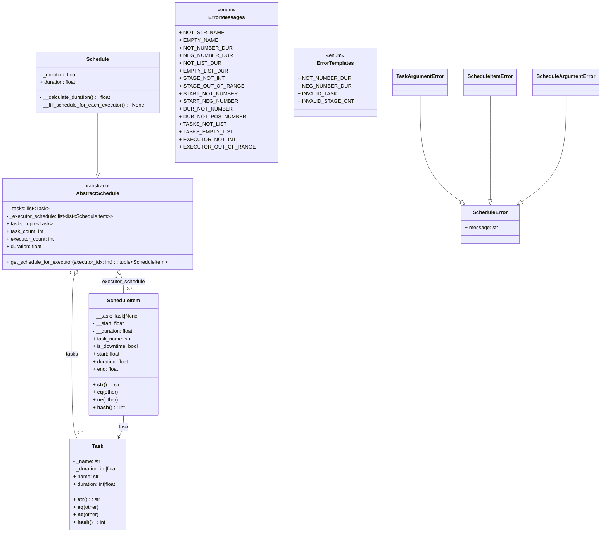

# Вариант 1. Диаграмма классов пакета `schedules` (ленточная стратегия)

Цель варианта 1 — разработать диаграмму классов пакета `schedule_pack` (в проекте
он реализован как пакет `schedules`) с использованием библиотеки
[mermaid-js – Class diagram](https://github.com/mermaid-js/mermaid#class-diagram).

Диаграмма должна показывать:

- основные сущности предметной области: задачи, элементы расписания;
- абстрактное расписание и конкретную реализацию ленточной стратегии;
- базовые классы для обработки ошибок, связанные с расписанием.

---

## 1. Диаграмма классов (Mermaid)

---
## 2. Разбор диаграммы

### 2.1. Основные сущности

**Task**
* Представляет одну задачу для расписания.
* Содержит закрытые поля _name и _duration.
* Через свойства name и duration предоставляет доступ только для чтения.
* Переопределяет __str__, __eq__, __hash__, чтобы:
    + удобно печатать задачи;
    + сравнивать их по значению;
    + использовать в коллекциях (например, в set и как ключи в dict).

**ScheduleItem**
* Описывает один элемент расписания:
    + либо фрагмент выполнения задачи (task не None);
    + либо период простоя (task равен None, is_downtime == True).
* Поля:
    + __task: Task | None — ссылка на задачу или None;
    + __start: float — момент начала;
    + __duration: float — длительность.
* Свойства:
    + task_name — имя задачи или "downtime";
    + start, duration, end — параметры временного интервала.
* Используется как «кирпичик» при построении расписания исполнителей.

### 2.2. Абстрактное и конкретное расписание

**AbstractSchedule**
* Абстрактный базовый класс для любого расписания.
* Хранит:
    + _tasks: list[Task] — исходный список задач;
    + _executor_schedule: list[list[ScheduleItem]] — таблица расписаний:
        - внешний список — исполнители,
        - внутренние списки — элементы расписания каждого исполнителя.
* Свойства:
    + tasks — кортеж задач (только для чтения);
    + task_count — количество задач;
    + executor_count — количество исполнителей;
    + duration — общая длительность расписания (абстрактное свойство).
* Метод:
    + get_schedule_for_executor(executor_idx) — возвращает расписание конкретного исполнителя с проверкой корректности индекса.
* Использует композицию:
    + одно расписание владеет многими задачами (tasks);
    + и многими элементами расписания (executor_schedule).

**Schedule**
* Конкретная реализация расписания по ленточной стратегии.
* Наследуется от AbstractSchedule.
* Дополнительно хранит:
    + _duration: float — минимальная длительность оптимального расписания (Topt).
* Свойства и методы:
    + duration — реализует абстрактное свойство базового класса и возвращает _duration;
    + __calculate_duration() — приватный метод, который:
        - считает сумму длительностей задач;
        - находит Tmax и Tavg;
        - выбирает Topt = max(Tmax, Tavg);
    + __fill_schedule_for_each_executor() — приватный метод, который:
        - рассматривает все задачи как одну временную линию;
        - разрезает её на «ленты» длиной Topt;
        - распределяет ленты между исполнителями;
        - при необходимости делит задачи на несколько ScheduleItem;
        - добавляет элементы простоя, когда исполнитель не занят.

### 2.3. Обработка ошибок

**ScheduleError**
* Базовый класс для всех ошибок пакета расписаний.
* Хранит текст сообщения об ошибке (message).
* Позволяет обрабатывать все ошибки расписания одним блоком `except ScheduleError`.

**TaskArgumentError**
* Наследуется от ScheduleError.
* Выбрасывается при некорректных параметрах задач:
    + название не является строкой;
    + название пустое;
    + длительность не число, нулевая или отрицательная.

**ScheduleItemError**
* Наследуется от ScheduleError.
* Выбрасывается при некорректных параметрах элементов расписания:
    + start не число или отрицательный;
    + duration не число, нулевая или отрицательная.

**ScheduleArgumentError**
* Наследуется от ScheduleError.
* Используется при ошибках инициализации расписания:
    + список задач не является list;
    + список задач пуст;
    + в списке есть элементы, которые не являются Task;
    + индекс исполнителя выходит за допустимый диапазон.

**ErrorMessages**
* Перечисление строковых констант с готовыми текстами ошибок.
* Используется во всех классах для формирования сообщений об ошибках.
* Позволяет не дублировать строки и централизованно менять тексты сообщений.

**ErrorTemplates**
* Перечисление шаблонов сообщений об ошибках.
* Применяется, когда нужно подставить параметры (например, номер задачи в списке) в текст ошибки.
* Делает сообщения более информативными, не захламляя код строковыми конкатенациями.
